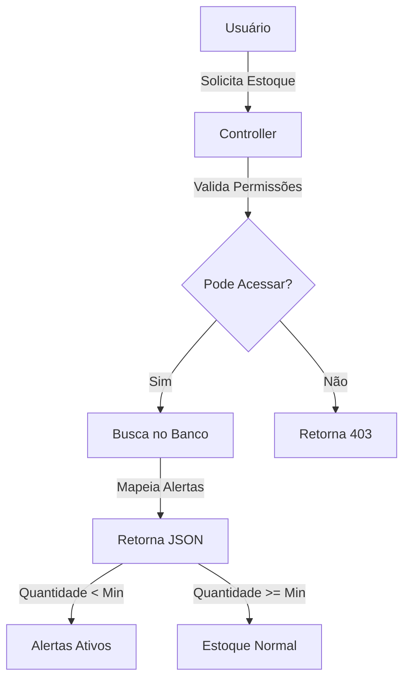

# 📦 Sistema de Estoque de Usuário - Guia Completo de Replicação

## 📋 Índice
1. [Visão Geral](#visão-geral)
2. [Arquitetura do Sistema](#arquitetura-do-sistema)
3. [Esquema de Banco de Dados](#esquema-de-banco-de-dados)
4. [Modelos Sequelize](#modelos-sequelize)
5. [Sistema de Permissões](#sistema-de-permissões)
6. [Lógica de Negócio](#lógica-de-negócio)
7. [API Endpoints](#api-endpoints)
8. [Exemplos de Uso](#exemplos-de-uso)
9. [Integração Frontend](#integração-frontend)

---

## 🎯 Visão Geral

O **Sistema de Estoque de Usuário** permite que cada usuário tenha seu próprio inventário de produtos, com controle de:
- ✅ Quantidade de cada produto por usuário
- ✅ Estoque mínimo (alertas)
- ✅ Movimentações de entrada/saída
- ✅ Histórico completo de transações
- ✅ Auditoria (quem fez cada movimentação)
- ✅ Permissões baseadas em roles

**Casos de Uso**:
- Controle de estoque individual para técnicos/mecânicos
- Gestão de ferramentas por colaborador
- Inventário pessoal de peças/componentes
- Rastreamento de materiais por responsável

---

## 🏗 Arquitetura do Sistema

### Componentes Principais

```
┌─────────────────────────────────────────────────┐
│           Frontend (React/Vue/etc)              │
│  - Lista de estoques                            │
│  - Alertas de estoque baixo                     │
│  - Movimentações (entrada/saída)                │
└────────────────┬────────────────────────────────┘
                 │ HTTP/JSON
┌────────────────▼────────────────────────────────┐
│              API REST (Express)                 │
│  - 12 endpoints                                 │
│  - Autenticação JWT                             │
│  - Autorização por roles                        │
└────────────────┬────────────────────────────────┘
                 │ ORM (Sequelize)
┌────────────────▼────────────────────────────────┐
│          Banco de Dados (PostgreSQL)            │
│  - estoque_usuarios                             │
│  - movimentacao_estoque_usuarios                │
│  - produtos                                      │
│  - usuarios                                      │
└─────────────────────────────────────────────────┘
```

### Fluxo de Dados



---

## 🗄 Esquema de Banco de Dados

### Tabela: `estoque_usuarios`

```sql
CREATE TABLE estoque_usuarios (
  id UUID PRIMARY KEY DEFAULT uuid_generate_v4(),
  
  -- Relacionamentos
  usuario_id UUID NOT NULL REFERENCES usuarios(id) ON DELETE CASCADE,
  produto_id UUID NOT NULL REFERENCES produtos(id) ON DELETE CASCADE,
  
  -- Dados de estoque
  quantidade INTEGER NOT NULL DEFAULT 0 CHECK (quantidade >= 0),
  estoque_minimo INTEGER NOT NULL DEFAULT 0 CHECK (estoque_minimo >= 0),
  ativo BOOLEAN NOT NULL DEFAULT true,
  
  -- Auditoria
  created_at TIMESTAMP WITH TIME ZONE NOT NULL DEFAULT NOW(),
  updated_at TIMESTAMP WITH TIME ZONE NOT NULL DEFAULT NOW(),
  
  -- Constraint de unicidade
  CONSTRAINT uk_estoque_usuario_produto UNIQUE (usuario_id, produto_id)
);

-- Índices para performance
CREATE INDEX idx_estoque_usuarios_usuario ON estoque_usuarios(usuario_id);
CREATE INDEX idx_estoque_usuarios_produto ON estoque_usuarios(produto_id);
CREATE INDEX idx_estoque_usuarios_ativo ON estoque_usuarios(ativo);
```

### Tabela: `movimentacao_estoque_usuarios`

```sql
CREATE TABLE movimentacao_estoque_usuarios (
  id UUID PRIMARY KEY DEFAULT uuid_generate_v4(),
  
  -- Relacionamentos
  usuario_id UUID NOT NULL REFERENCES usuarios(id) ON DELETE CASCADE,
  produto_id UUID NOT NULL REFERENCES produtos(id) ON DELETE CASCADE,
  lancado_por_id UUID NOT NULL REFERENCES usuarios(id) ON DELETE CASCADE,
  
  -- Dados da movimentação
  tipo_movimentacao VARCHAR(10) NOT NULL CHECK (tipo_movimentacao IN ('entrada', 'saida')),
  quantidade INTEGER NOT NULL CHECK (quantidade > 0),
  
  -- Auditoria de saldo
  quantidade_anterior INTEGER NOT NULL CHECK (quantidade_anterior >= 0),
  quantidade_atual INTEGER NOT NULL CHECK (quantidade_atual >= 0),
  
  -- Timestamps
  data_movimentacao TIMESTAMP WITH TIME ZONE NOT NULL DEFAULT NOW(),
  created_at TIMESTAMP WITH TIME ZONE NOT NULL DEFAULT NOW(),
  updated_at TIMESTAMP WITH TIME ZONE NOT NULL DEFAULT NOW()
);

-- Índices para consultas rápidas
CREATE INDEX idx_mov_estoque_usuario ON movimentacao_estoque_usuarios(usuario_id);
CREATE INDEX idx_mov_estoque_produto ON movimentacao_estoque_usuarios(produto_id);
CREATE INDEX idx_mov_estoque_data ON movimentacao_estoque_usuarios(data_movimentacao);
CREATE INDEX idx_mov_estoque_usuario_data ON movimentacao_estoque_usuarios(usuario_id, data_movimentacao);
```

### Relacionamentos

```
usuarios (1) ----< (N) estoque_usuarios
produtos (1) ----< (N) estoque_usuarios

usuarios (1) ----< (N) movimentacao_estoque_usuarios [como usuario]
usuarios (1) ----< (N) movimentacao_estoque_usuarios [como lancadoPor]
produtos (1) ----< (N) movimentacao_estoque_usuarios
```

---

## 🔧 Modelos Sequelize

### Model: EstoqueUsuario

```javascript
import { DataTypes } from "sequelize";
import sequelize from "../database/connection.js";
import Usuario from "./Usuario.js";
import Produto from "./Produto.js";

const EstoqueUsuario = sequelize.define(
  "EstoqueUsuario",
  {
    id: {
      type: DataTypes.UUID,
      defaultValue: DataTypes.UUIDV4,
      primaryKey: true,
    },
    usuarioId: {
      type: DataTypes.UUID,
      allowNull: false,
      references: {
        model: "usuarios",
        key: "id",
      },
      onDelete: "CASCADE",
    },
    produtoId: {
      type: DataTypes.UUID,
      allowNull: false,
      references: {
        model: "produtos",
        key: "id",
      },
      onDelete: "CASCADE",
    },
    quantidade: {
      type: DataTypes.INTEGER,
      allowNull: false,
      defaultValue: 0,
      validate: {
        min: 0,
      },
    },
    estoqueMinimo: {
      type: DataTypes.INTEGER,
      allowNull: false,
      defaultValue: 0,
      validate: {
        min: 0,
      },
    },
    ativo: {
      type: DataTypes.BOOLEAN,
      allowNull: false,
      defaultValue: true,
    },
  },
  {
    tableName: "estoque_usuarios",
    underscored: true,
    indexes: [
      {
        unique: true,
        fields: ["usuario_id", "produto_id"],
        name: "uk_estoque_usuario_produto",
      },
      {
        fields: ["usuario_id"],
      },
      {
        fields: ["produto_id"],
      },
      {
        fields: ["ativo"],
      },
    ],
  }
);

// Relacionamentos
EstoqueUsuario.belongsTo(Usuario, {
  foreignKey: "usuarioId",
  as: "usuario",
});

EstoqueUsuario.belongsTo(Produto, {
  foreignKey: "produtoId",
  as: "produto",
});

export default EstoqueUsuario;
```

### Model: MovimentacaoEstoqueUsuario

```javascript
import { DataTypes } from "sequelize";
import sequelize from "../database/connection.js";
import Usuario from "./Usuario.js";
import Produto from "./Produto.js";

const MovimentacaoEstoqueUsuario = sequelize.define(
  "MovimentacaoEstoqueUsuario",
  {
    id: {
      type: DataTypes.UUID,
      defaultValue: DataTypes.UUIDV4,
      primaryKey: true,
    },
    usuarioId: {
      type: DataTypes.UUID,
      allowNull: false,
      references: {
        model: "usuarios",
        key: "id",
      },
      onDelete: "CASCADE",
    },
    produtoId: {
      type: DataTypes.UUID,
      allowNull: false,
      references: {
        model: "produtos",
        key: "id",
      },
      onDelete: "CASCADE",
    },
    lancadoPorId: {
      type: DataTypes.UUID,
      allowNull: false,
      references: {
        model: "usuarios",
        key: "id",
      },
      onDelete: "CASCADE",
    },
    tipoMovimentacao: {
      type: DataTypes.ENUM("entrada", "saida"),
      allowNull: false,
    },
    quantidade: {
      type: DataTypes.INTEGER,
      allowNull: false,
      validate: {
        min: 1,
      },
    },
    quantidadeAnterior: {
      type: DataTypes.INTEGER,
      allowNull: false,
      validate: {
        min: 0,
      },
    },
    quantidadeAtual: {
      type: DataTypes.INTEGER,
      allowNull: false,
      validate: {
        min: 0,
      },
    },
    dataMovimentacao: {
      type: DataTypes.DATE,
      allowNull: false,
      defaultValue: DataTypes.NOW,
    },
  },
  {
    tableName: "movimentacao_estoque_usuarios",
    underscored: true,
    indexes: [
      {
        fields: ["usuario_id"],
      },
      {
        fields: ["produto_id"],
      },
      {
        fields: ["data_movimentacao"],
      },
      {
        fields: ["usuario_id", "data_movimentacao"],
      },
    ],
  }
);

// Relacionamentos
MovimentacaoEstoqueUsuario.belongsTo(Usuario, {
  foreignKey: "usuarioId",
  as: "usuario",
});

MovimentacaoEstoqueUsuario.belongsTo(Usuario, {
  foreignKey: "lancadoPorId",
  as: "lancadoPor",
});

MovimentacaoEstoqueUsuario.belongsTo(Produto, {
  foreignKey: "produtoId",
  as: "produto",
});

export default MovimentacaoEstoqueUsuario;
```

---

## 🔐 Sistema de Permissões

### Roles de Usuário

```javascript
const ROLES_GESTAO_ESTOQUE = ["ADMIN", "CONTROLADOR_ESTOQUE"];
```

### Funções de Verificação

```javascript
// Verifica se o usuário pode gerenciar TODOS os estoques
function podeGerenciarTodosEstoques(usuario) {
  return ROLES_GESTAO_ESTOQUE.includes(usuario?.role);
}

// Verifica se o usuário pode acessar estoque de um usuário específico
function podeAcessarEstoqueUsuario(usuario, usuarioIdAlvo) {
  // ADMIN e CONTROLADOR_ESTOQUE podem ver qualquer estoque
  if (podeGerenciarTodosEstoques(usuario)) {
    return true;
  }
  
  // Qualquer usuário pode ver seu próprio estoque
  return String(usuario?.id) === String(usuarioIdAlvo);
}
```

### Regras de Autorização

| Ação | ADMIN | CONTROLADOR_ESTOQUE | Usuário Normal |
|------|-------|---------------------|----------------|
| Ver próprio estoque | ✅ | ✅ | ✅ |
| Ver estoque de outro usuário | ✅ | ✅ | ❌ |
| Ver lista de todos estoques | ✅ | ✅ | ❌ |
| Adicionar/Remover estoque | ✅ | ✅ | ❌ |
| Movimentar estoque | ✅ | ✅ | ❌ |
| Ver movimentações de terceiros | ✅ | ✅ | ❌ |

---

## 📊 Lógica de Negócio

### Sistema de Alertas

```javascript
// Mapeia alertas com base no estoque mínimo
function mapearAlertas(estoques) {
  return estoques.map((item) => {
    const alertaAtivo = item.quantidade < item.estoqueMinimo;
    const percentualEstoque = item.estoqueMinimo > 0
      ? (item.quantidade / item.estoqueMinimo) * 100
      : 100;

    return {
      ...item.toJSON(),
      alertaAtivo,
      percentualEstoque: Math.round(percentualEstoque),
      diferencaMinimo: item.estoqueMinimo - item.quantidade,
    };
  });
}
```

### Movimentação de Estoque (Lógica Complexa)

**Algoritmo de Movimentação em Lote**:

```javascript
// 1. Validação de todas as movimentações ANTES de aplicar qualquer mudança
for (const movimentacao of movimentacoes) {
  // Validar tipo ('entrada' ou 'saida')
  // Validar quantidade > 0
  // Validar se produto existe
}

// 2. Buscar estoques atuais do usuário
const estoquesAtuais = await EstoqueUsuario.findAll({
  where: { usuarioId, produtoId: [...produtoIds] }
});

// 3. Simular saldo após TODAS as movimentações
const saldoSimulado = new Map();
for (const movimentacao of movimentacoes) {
  const saldoAnterior = saldoSimulado.get(produtoId) || 0;
  
  if (movimentacao.tipo === 'saida' && quantidade > saldoAnterior) {
    throw new Error("Estoque insuficiente");
  }
  
  const saldoAtual = tipo === 'entrada' 
    ? saldoAnterior + quantidade 
    : saldoAnterior - quantidade;
    
  saldoSimulado.set(produtoId, saldoAtual);
}

// 4. Aplicar mudanças no banco de dados
for (const [produtoId, saldoFinal] of saldoSimulado) {
  await atualizarEstoque(usuarioId, produtoId, saldoFinal);
}

// 5. Registrar histórico de movimentações
await MovimentacaoEstoqueUsuario.bulkCreate(registrosHistorico);
```

### Validações Importantes

```javascript
// Quantidade deve ser >= 0
function validarQuantidade(quantidade) {
  const num = Number(quantidade);
  return Number.isFinite(num) && num >= 0;
}

// Impedir saídas maiores que o estoque
function validarSaida(quantidadeAtual, quantidadeSaida) {
  return quantidadeAtual >= quantidadaSaida;
}

// Validar datas para filtros de histórico
function validarPeriodo(dataInicio, dataFim) {
  const inicio = new Date(dataInicio);
  const fim = new Date(dataFim);
  
  if (isNaN(inicio) || isNaN(fim)) {
    throw new Error("Datas inválidas");
  }
  
  if (inicio > fim) {
    throw new Error("Data inicial não pode ser maior que data final");
  }
  
  return { inicio, fim };
}
```

---

## 🌐 API Endpoints

### 1. Listar Meu Estoque

```http
GET /api/estoque-usuarios/me
Authorization: Bearer {token}
```

**Resposta:**
```json
[
  {
    "id": "uuid",
    "usuarioId": "uuid",
    "produtoId": "uuid",
    "quantidade": 15,
    "estoqueMinimo": 10,
    "ativo": true,
    "produto": {
      "id": "uuid",
      "nome": "Parafuso M8",
      "codigo": "PAR-M8",
      "emoji": "🔩"
    }
  }
]
```

### 2. Listar Meus Alertas de Estoque Baixo

```http
GET /api/estoque-usuarios/me/alertas
Authorization: Bearer {token}
```

**Resposta:**
```json
[
  {
    "id": "uuid",
    "usuarioId": "uuid",
    "produtoId": "uuid",
    "quantidade": 3,
    "estoqueMinimo": 10,
    "alertaAtivo": true,
    "percentualEstoque": 30,
    "diferencaMinimo": 7,
    "produto": {
      "nome": "Óleo Motor 5W30",
      "codigo": "OLEO-5W30"
    }
  }
]
```

### 3. Listar Estoque de Um Usuário Específico

```http
GET /api/estoque-usuarios/{usuarioId}
Authorization: Bearer {token}
```

**Permissões**: ADMIN, CONTROLADOR_ESTOQUE ou o próprio usuário

### 4. Listar Todos os Estoques (Admin)

```http
GET /api/estoque-usuarios
Authorization: Bearer {token}
```

**Permissões**: ADMIN, CONTROLADOR_ESTOQUE

**Resposta:**
```json
[
  {
    "id": "uuid",
    "usuarioId": "uuid",
    "produtoId": "uuid",
    "quantidade": 25,
    "estoqueMinimo": 15,
    "produto": { "nome": "Filtro Ar" },
    "usuario": { 
      "nome": "João Silva",
      "email": "joao@empresa.com",
      "role": "GERENCIADOR"
    }
  }
]
```

### 5. Listar Usuários Disponíveis para Estoque

```http
GET /api/estoque-usuarios/usuarios
Authorization: Bearer {token}
```

**Permissões**: ADMIN, CONTROLADOR_ESTOQUE

### 6. Listar Movimentações de Um Usuário

```http
GET /api/estoque-usuarios/movimentacoes?usuarioId=uuid&dataInicio=2024-01-01&dataFim=2024-01-31
Authorization: Bearer {token}
```

**Permissões**: ADMIN, CONTROLADOR_ESTOQUE

**Query Parameters**:
- `usuarioId` (obrigatório): UUID do usuário
- `dataInicio` (obrigatório): YYYY-MM-DD
- `dataFim` (obrigatório): YYYY-MM-DD

**Resposta:**
```json
[
  {
    "id": "uuid",
    "usuarioId": "uuid",
    "produtoId": "uuid",
    "tipoMovimentacao": "entrada",
    "quantidade": 10,
    "quantidadeAnterior": 5,
    "quantidadeAtual": 15,
    "dataMovimentacao": "2024-01-15T10:30:00Z",
    "usuario": { "nome": "João Silva" },
    "lancadoPor": { "nome": "Admin Sistema" },
    "produto": { "nome": "Parafuso M8", "codigo": "PAR-M8" }
  }
]
```

### 7. Criar ou Atualizar Produto no Estoque

```http
POST /api/estoque-usuarios/{usuarioId}
Authorization: Bearer {token}
Content-Type: application/json
```

**Permissões**: ADMIN, CONTROLADOR_ESTOQUE

**Body:**
```json
{
  "produtoId": "uuid",
  "quantidade": 20,
  "estoqueMinimo": 10
}
```

**Comportamento**:
- Se o produto não existe no estoque do usuário: **CRIA**
- Se o produto já existe: **ATUALIZA** quantidade e estoque mínimo

### 8. Atualizar Estoque Específico

```http
PUT /api/estoque-usuarios/{usuarioId}/{produtoId}
Authorization: Bearer {token}
Content-Type: application/json
```

**Permissões**: ADMIN, CONTROLADOR_ESTOQUE

**Body:**
```json
{
  "quantidade": 30,
  "estoqueMinimo": 15
}
```

### 9. Atualizar Vários Estoques em Lote

```http
POST /api/estoque-usuarios/{usuarioId}/varios
Authorization: Bearer {token}
Content-Type: application/json
```

**Permissões**: ADMIN, CONTROLADOR_ESTOQUE

**Body:**
```json
{
  "estoques": [
    { "produtoId": "uuid1", "quantidade": 10, "estoqueMinimo": 5 },
    { "produtoId": "uuid2", "quantidade": 25, "estoqueMinimo": 10 },
    { "produtoId": "uuid3", "quantidade": 8, "estoqueMinimo": 3 }
  ]
}
```

**Resposta:**
```json
{
  "message": "3 estoques processados com sucesso",
  "estoques": [...],
  "erros": []
}
```

### 10. Movimentar Estoque (Entrada/Saída)

```http
POST /api/estoque-usuarios/{usuarioId}/movimentar
Authorization: Bearer {token}
Content-Type: application/json
```

**Permissões**: ADMIN, CONTROLADOR_ESTOQUE

**Body (simples):**
```json
{
  "produtoId": "uuid",
  "tipoMovimentacao": "entrada",
  "quantidade": 10
}
```

**Body (múltiplas movimentações):**
```json
{
  "movimentacoes": [
    { "produtoId": "uuid1", "tipoMovimentacao": "entrada", "quantidade": 10 },
    { "produtoId": "uuid2", "tipoMovimentacao": "saida", "quantidade": 5 },
    { "produtoId": "uuid1", "tipoMovimentacao": "entrada", "quantidade": 3 }
  ]
}
```

**Características**:
- ✅ Validação de estoque suficiente para saídas
- ✅ Simulação de saldo ANTES de aplicar mudanças
- ✅ Registro completo no histórico (quantidadeAnterior e quantidadeAtual)
- ✅ Auditoria com `lancadoPorId`

### 11. Deletar Produto do Estoque

```http
DELETE /api/estoque-usuarios/{usuarioId}/{produtoId}
Authorization: Bearer {token}
```

**Permissões**: ADMIN, CONTROLADOR_ESTOQUE

**Resposta:**
```json
{
  "message": "Estoque removido com sucesso"
}
```

---

## 💡 Exemplos de Uso

### Cenário 1: Técnico Consulta Seu Estoque

```javascript
// Frontend
const response = await fetch('/api/estoque-usuarios/me', {
  headers: {
    'Authorization': `Bearer ${token}`
  }
});

const meuEstoque = await response.json();

// Exibir produtos com alerta
const produtosComAlerta = meuEstoque.filter(item => 
  item.quantidade < item.estoqueMinimo
);
```

### Cenário 2: Admin Adiciona Produtos ao Estoque de um Técnico

```javascript
// Frontend (Admin adicionando 20 parafusos ao estoque do João)
const usuarioId = 'uuid-joao';
await fetch(`/api/estoque-usuarios/${usuarioId}`, {
  method: 'POST',
  headers: {
    'Authorization': `Bearer ${tokenAdmin}`,
    'Content-Type': 'application/json'
  },
  body: JSON.stringify({
    produtoId: 'uuid-parafuso-m8',
    quantidade: 20,
    estoqueMinimo: 10
  })
});
```

### Cenário 3: Técnico Retira Peças do Estoque (Movimentação)

```javascript
// Frontend (Técnico usa 5 parafusos em uma manutenção)
const usuarioId = 'uuid-joao';
await fetch(`/api/estoque-usuarios/${usuarioId}/movimentar`, {
  method: 'POST',
  headers: {
    'Authorization': `Bearer ${tokenAdmin}`,
    'Content-Type': 'application/json'
  },
  body: JSON.stringify({
    produtoId: 'uuid-parafuso-m8',
    tipoMovimentacao: 'saida',
    quantidade: 5
  })
});
```

### Cenário 4: Consultar Histórico de Movimentações

```javascript
// Frontend (Admin consulta movimentações do técnico em janeiro)
const params = new URLSearchParams({
  usuarioId: 'uuid-joao',
  dataInicio: '2024-01-01',
  dataFim: '2024-01-31'
});

const response = await fetch(`/api/estoque-usuarios/movimentacoes?${params}`, {
  headers: {
    'Authorization': `Bearer ${tokenAdmin}`
  }
});

const movimentacoes = await response.json();

// Exibir em tabela
movimentacoes.forEach(mov => {
  console.log(`${mov.dataMovimentacao}: ${mov.tipoMovimentacao.toUpperCase()} de ${mov.quantidade} ${mov.produto.nome}`);
  console.log(`  Saldo: ${mov.quantidadeAnterior} → ${mov.quantidadeAtual}`);
});
```

---

## 🎨 Integração Frontend

### Componente React: Lista de Estoque com Alertas

```jsx
import React, { useState, useEffect } from 'react';
import { AlertTriangle } from 'lucide-react';

function MeuEstoque() {
  const [estoque, setEstoque] = useState([]);
  const [loading, setLoading] = useState(true);

  useEffect(() => {
    fetch('/api/estoque-usuarios/me', {
      headers: {
        'Authorization': `Bearer ${localStorage.getItem('token')}`
      }
    })
      .then(res => res.json())
      .then(data => {
        setEstoque(data);
        setLoading(false);
      });
  }, []);

  if (loading) return <div>Carregando...</div>;

  return (
    <div className="estoque-container">
      <h2>Meu Estoque de Produtos</h2>
      <table>
        <thead>
          <tr>
            <th>Produto</th>
            <th>Quantidade</th>
            <th>Mínimo</th>
            <th>Status</th>
          </tr>
        </thead>
        <tbody>
          {estoque.map(item => {
            const alertaAtivo = item.quantidade < item.estoqueMinimo;
            
            return (
              <tr key={item.id} className={alertaAtivo ? 'alerta' : ''}>
                <td>
                  {item.produto.emoji} {item.produto.nome}
                </td>
                <td>{item.quantidade}</td>
                <td>{item.estoqueMinimo}</td>
                <td>
                  {alertaAtivo && (
                    <span className="badge-alerta">
                      <AlertTriangle size={16} />
                      Estoque Baixo
                    </span>
                  )}
                </td>
              </tr>
            );
          })}
        </tbody>
      </table>
    </div>
  );
}

export default MeuEstoque;
```

### Componente: Movimentar Estoque

```jsx
import React, { useState } from 'react';

function MovimentarEstoque({ usuarioId, produtoId, onSuccess }) {
  const [tipo, setTipo] = useState('entrada');
  const [quantidade, setQuantidade] = useState(1);
  const [loading, setLoading] = useState(false);

  const handleSubmit = async (e) => {
    e.preventDefault();
    setLoading(true);

    try {
      const response = await fetch(`/api/estoque-usuarios/${usuarioId}/movimentar`, {
        method: 'POST',
        headers: {
          'Authorization': `Bearer ${localStorage.getItem('token')}`,
          'Content-Type': 'application/json'
        },
        body: JSON.stringify({
          produtoId,
          tipoMovimentacao: tipo,
          quantidade: Number(quantidade)
        })
      });

      if (response.ok) {
        alert('Movimentação registrada com sucesso!');
        onSuccess();
      } else {
        const error = await response.json();
        alert(`Erro: ${error.error}`);
      }
    } catch (error) {
      alert('Erro ao movimentar estoque');
    } finally {
      setLoading(false);
    }
  };

  return (
    <form onSubmit={handleSubmit}>
      <h3>Movimentar Estoque</h3>
      
      <label>
        Tipo:
        <select value={tipo} onChange={(e) => setTipo(e.target.value)}>
          <option value="entrada">Entrada</option>
          <option value="saida">Saída</option>
        </select>
      </label>

      <label>
        Quantidade:
        <input
          type="number"
          min="1"
          value={quantidade}
          onChange={(e) => setQuantidade(e.target.value)}
        />
      </label>

      <button type="submit" disabled={loading}>
        {loading ? 'Processando...' : 'Confirmar'}
      </button>
    </form>
  );
}

export default MovimentarEstoque;
```

---

## 🚀 Checklist de Implementação

### Fase 1: Banco de Dados
- [ ] Criar tabela `estoque_usuarios`
- [ ] Criar tabela `movimentacao_estoque_usuarios`
- [ ] Adicionar constraints e índices
- [ ] Testar relacionamentos com `usuarios` e `produtos`

### Fase 2: Modelos
- [ ] Criar model `EstoqueUsuario` no Sequelize
- [ ] Criar model `MovimentacaoEstoqueUsuario`
- [ ] Configurar associações (belongsTo)
- [ ] Testar queries básicas

### Fase 3: Controller e Lógica
- [ ] Implementar funções auxiliares (validações, permissões)
- [ ] Criar controller `estoqueUsuarioController.js`
- [ ] Implementar 11 funções principais
- [ ] Adicionar sistema de alertas (mapearAlertas)
- [ ] Implementar lógica de movimentação em lote

### Fase 4: Rotas
- [ ] Criar arquivo `estoqueUsuario.routes.js`
- [ ] Configurar 12 endpoints
- [ ] Adicionar middlewares de autenticação
- [ ] Adicionar middlewares de autorização por role
- [ ] Registrar rotas no index principal

### Fase 5: Testes
- [ ] Testar criação de estoque
- [ ] Testar movimentações de entrada
- [ ] Testar movimentações de saída (validar erro de estoque insuficiente)
- [ ] Testar permissões (usuário normal não pode acessar estoque de outro)
- [ ] Testar sistema de alertas
- [ ] Testar histórico de movimentações

### Fase 6: Frontend
- [ ] Criar página "Meu Estoque"
- [ ] Criar componente de alertas de estoque baixo
- [ ] Criar formulário de movimentação
- [ ] Criar histórico de movimentações
- [ ] Admin: página de gestão de estoques de usuários

---

## 📝 Notas Importantes

### Boas Práticas

1. **Transações Atômicas**: Use transações para movimentações em lote
   ```javascript
   const t = await sequelize.transaction();
   try {
     // Operações...
     await t.commit();
   } catch (error) {
     await t.rollback();
   }
   ```

2. **Validação Dupla**: Valide no frontend E no backend

3. **Auditoria**: Sempre registre `lancadoPorId` para rastreabilidade

4. **Índices**: Os índices são cruciais para performance em grandes volumes

5. **Soft Delete**: Considere usar `ativo: false` ao invés de deletar fisicamente

### Problemas Comuns e Soluções

#### ❌ Problema: Estoque negativo após movimentação
**Solução**: Sempre simular saldo ANTES de aplicar mudanças

#### ❌ Problema: Movimentações perdidas em erros
**Solução**: Usar transações do Sequelize

#### ❌ Problema: Performance lenta com muitos usuários
**Solução**: Adicionar índices em `usuario_id` e `data_movimentacao`

#### ❌ Problema: Usuário vê estoque de outro usuário
**Solução**: Sempre validar com `podeAcessarEstoqueUsuario()`

---

## 🎯 Conclusão

Este sistema fornece:
- ✅ Controle completo de estoque por usuário
- ✅ Rastreamento de todas as movimentações
- ✅ Sistema de alertas automático
- ✅ Permissões granulares por role
- ✅ Auditoria completa (quem, quando, quanto)
- ✅ API REST completa e documentada
- ✅ Pronto para integração frontend

**Tempo estimado de implementação**: 2-3 dias para desenvolvedor experiente

**Arquivos de referência neste projeto**:
- `src/models/EstoqueUsuario.js`
- `src/models/MovimentacaoEstoqueUsuario.js`
- `src/controllers/estoqueUsuarioController.js`
- `src/routes/estoqueUsuario.routes.js`

---

**📅 Documentação criada**: Janeiro 2025  
**🔖 Versão**: 1.0  
**👨‍💻 Sistema**: StarBox Backend
